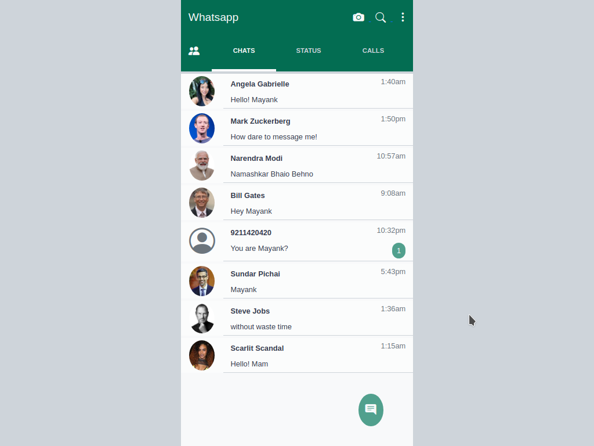

# Clone-3

- Name : "Whatsapp"

- Description : "try to copy Whatsapp ui just of practice"

- Version : 1.0

- Update :03-09-2023

- Status : ACTIVE

- Responsive : True

- TecStack : { HTML | CSS | JavaScript }

- Thanks : { VSCode | GitHub | Whatsapp }

- Work : Self

- Design : { Mayank }

- Developer : { Mayank }

- CopyRight : { Whatsapp }

- URL : https://mayankdevil.github.io/clone-3/

- Clone : https://github.com/MayankDevil/clone-3.git

- Download : https://github.com/MayankDevil/clone-3/archive/refs/heads/main.zip

---

### Home Page

## NOTE

_this repository is the clone of **Whatsapp**. I am just try to copy and develope to make better version as my imagination because i am developer_

## Message

_this is whatsapp mobile for mobile_
